# CESAR CANAZA
## Find me at:
[](https://www.facebook.com/cesar.willy.mamani.canaza)
</br>
[](https://www.linkedin.com/in/cesarwillymc)
## Contact me:
[](mailto:cesarwilly.mc@gmail.com)

# Technical Stack

| Technology         | Logo                                                                                     |
|--------------------|------------------------------------------------------------------------------------------|
| GitHub             |             |
| Coil               |         |
| Dagger Hilt        | 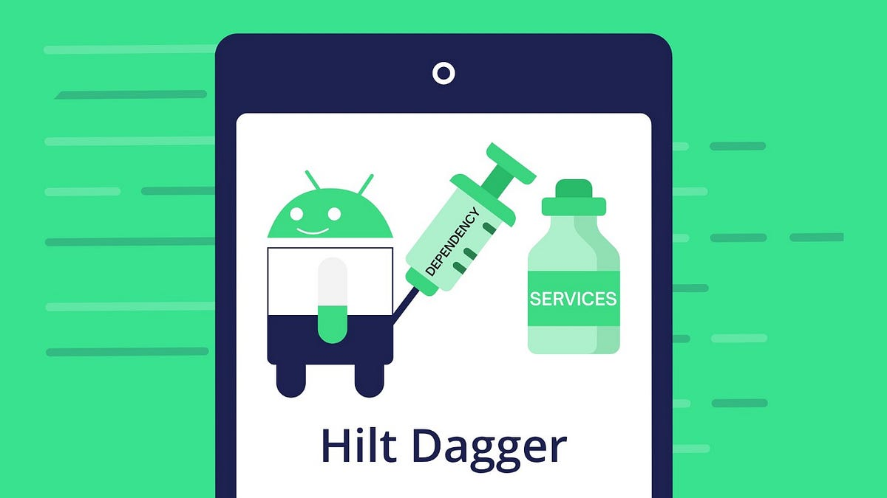 |
| JUnit              |               |
| Jetpack Compose    |   |
| Proguard R8        | 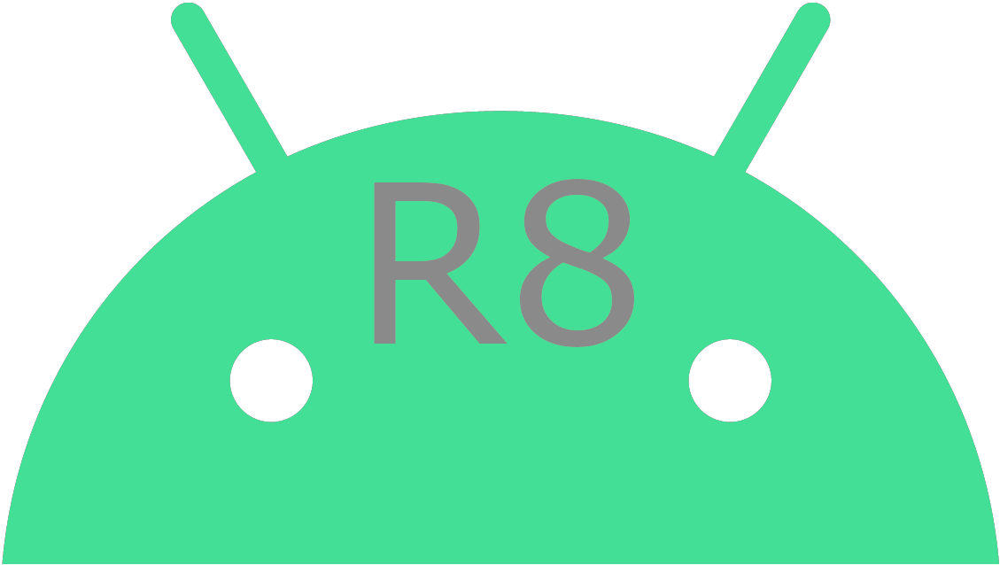     |
| Room               | 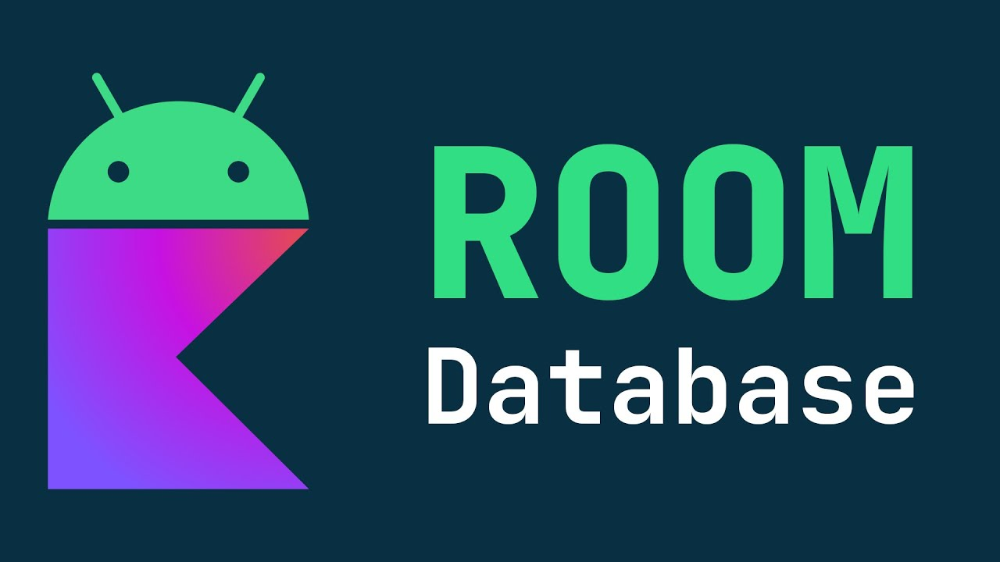       |
| Split IO           | 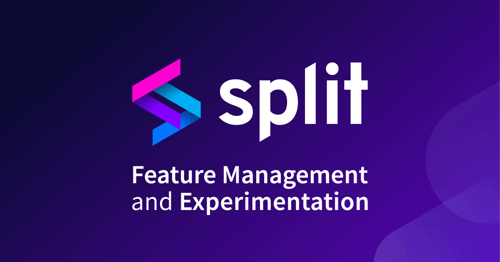        |
| GraphQL            |           |


## Image of application
| Screenshot                                               | Title                | Technology                                                                           | Description                                                                                                                                                                    |
|----------------------------------------------------------|----------------------|--------------------------------------------------------------------------------------|--------------------------------------------------------------------------------------------------------------------------------------------------------------------------------|
| 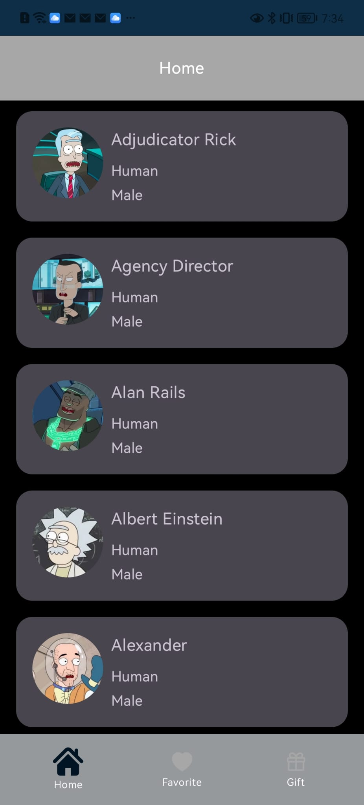                   | Screen Menu          | GraphQL, ViewModel, Coroutine, Hilt, UnitTest, ApolloTest, RootBeat, Security, Pager | This screen consume services of apollo  and bring all the person each 20 items                                                                                                 |
| 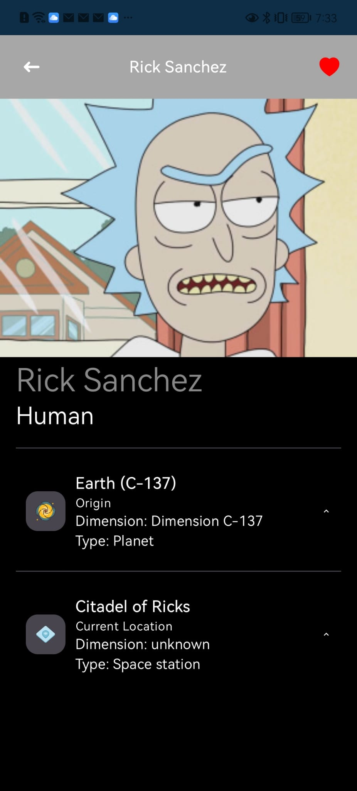               | Screen Detail        | GraphQL, ViewModel, Coroutine, Hilt, UnitTest, Room, Split IO                        | This screen bring the data of the database or by the service, this logic is in the domain. After to get the information print the screen with the information of the character |
| 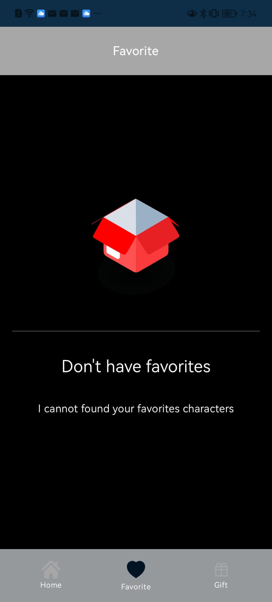           | Screen Favorite      | Room, ViewModel, Coroutine, Hilt, UnitTest, Room, Split IO                           | In this screen we get the data from Room                                                                                                                                       |
| 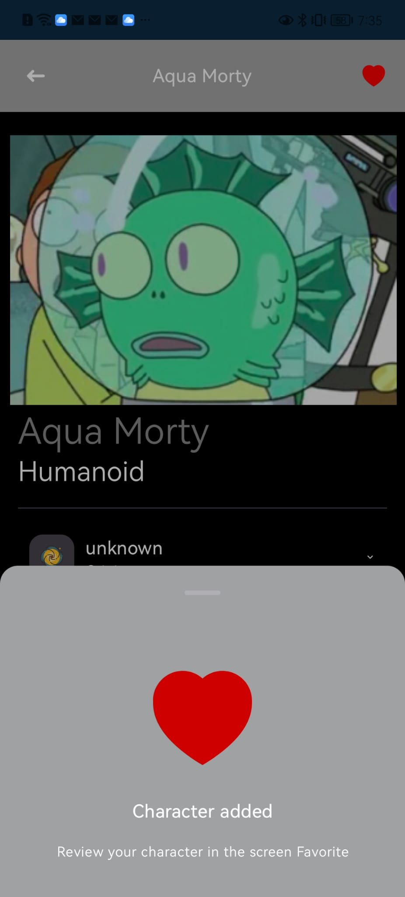 | Screen Favorite Mark | GraphQL, ViewModel, Coroutine, Hilt, UnitTest, Room, Split IO                        | For saving the data using Room                                                                                                                                                 |
| 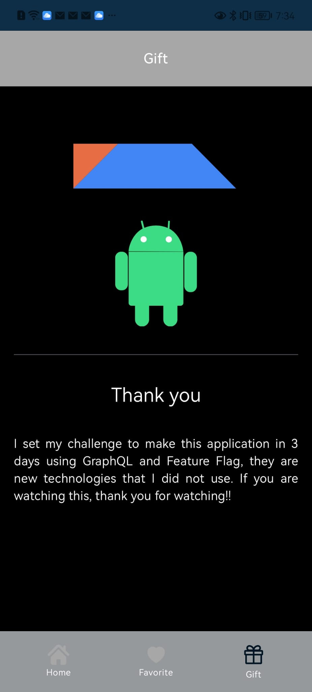           | Screen Split IO      | Split IO        | This screen is managed by SPLIT IO using the concept FEATURE FLAGGING                                                                                                          |
| 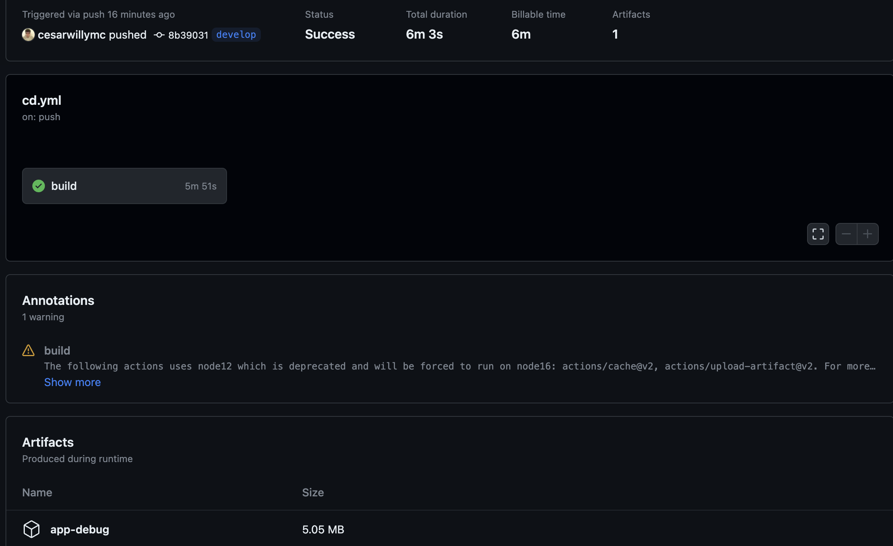            | Github Workflow      | Github         | We configurate manually the workflows in github in the directory     `.github/Workflows/cd.yml `                                                                               |
| 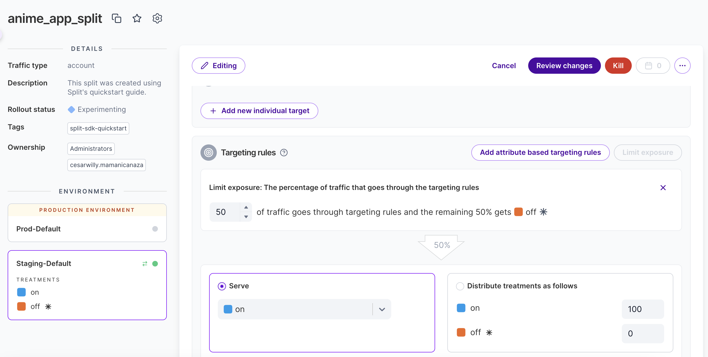                          | SPLIT IO             | Split IO  | Configuration of the flag in `split io`   |
| 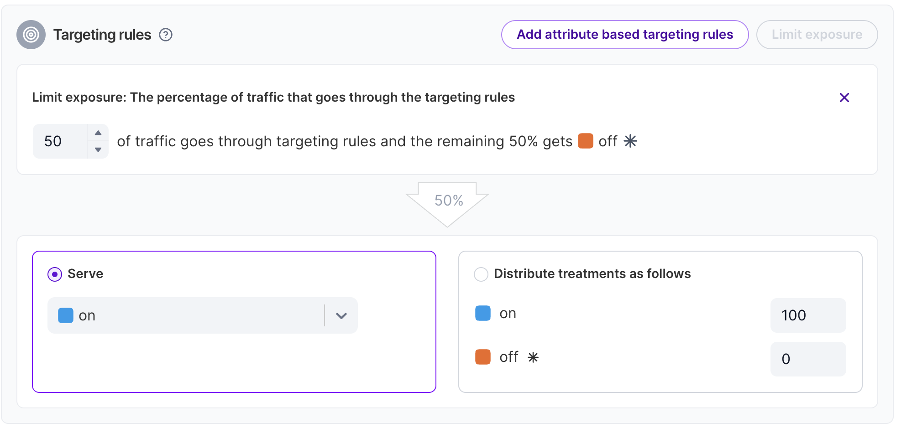                | SPLIT IO             | Split IO  | Configuration of the flag in `split io`   |

## Configuration: 

### Local.properties
Add  this line
```
url_graphql=https://rickandmortyapi.com/graphql
name_database=your_name_database
split_io_key = your_split_io_key
feature_flag= anime_app_split
```

### Gradle Java

Go to **Gradle JDK** and change to **Java17**

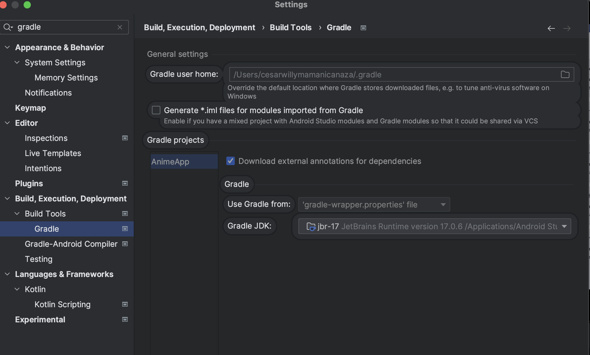  

## References:

- [Split.io](https://www.split.io/)
- [GraphQL](https://graphql.org/code/#java-kotlin)
- [JUnit](https://junit.org/junit4/)
- [GitHub Actions - Using Secrets](https://docs.github.com/en/actions/security-guides/using-secrets-in-github-actions)
- [Apollo GraphQL Testing](https://www.apollographql.com/docs/kotlin/testing/overview/)
- [Clean Architecture Android](https://antonioleiva.com/clean-architecture-android/)
- [Room Persistence Library](https://developer.android.com/training/data-storage/room)
- [Shrink Your Code](https://developer.android.com/build/shrink-code)


